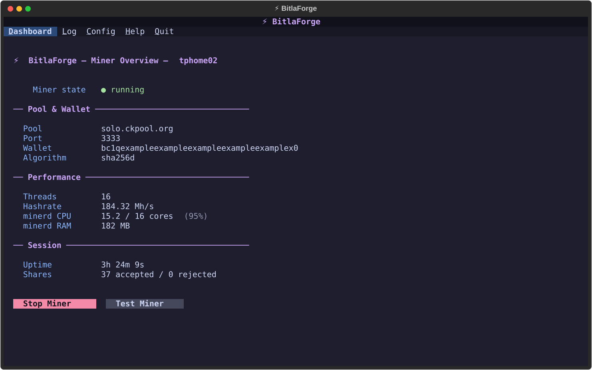
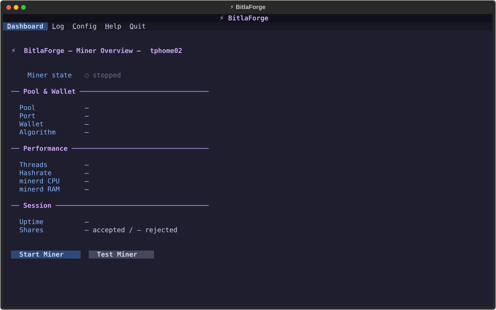
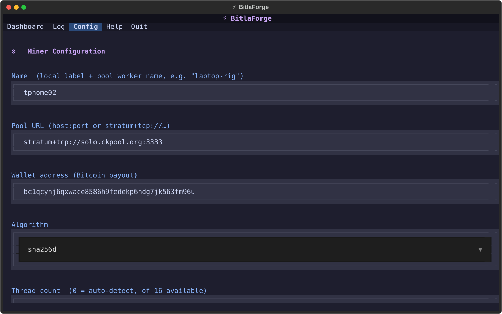
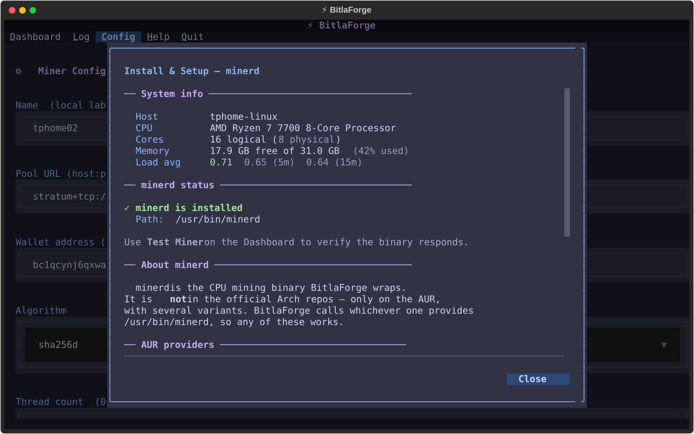
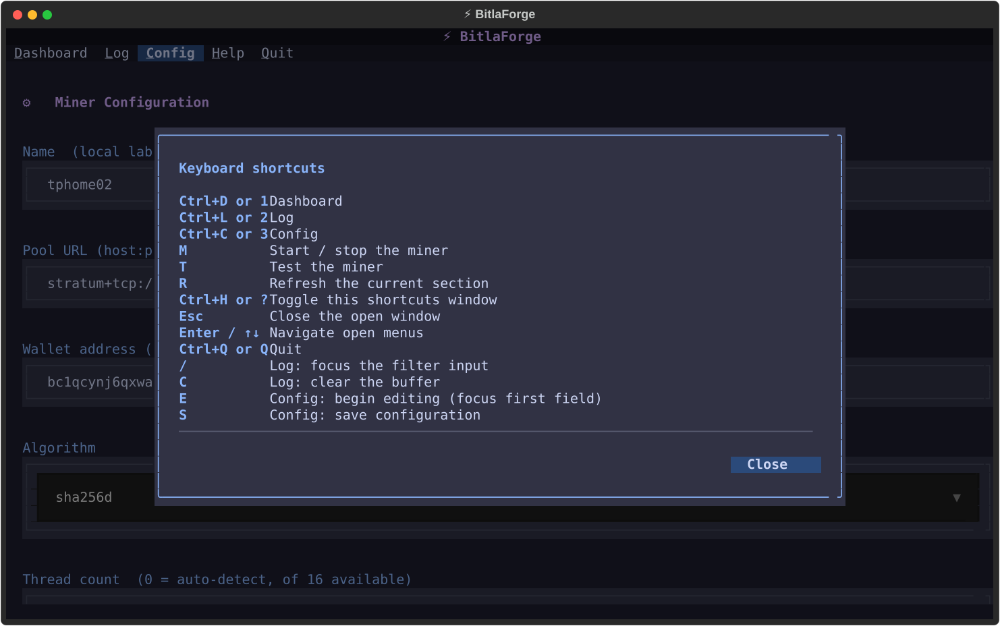

# ⚡ bitlaForge

> A terminal dashboard for solo Bitcoin mining, presented as what it really is — a *lottery*. It runs `minerd`, watches it work, and doesn't pretend the odds are anything but astronomical.


[](https://aur.archlinux.org/packages/bitlaforge)

> 🛡 **Security** — every release is GPG-signed and every commit is GitHub-Verified. **[Where We Stand](https://github.com/jetomev/KognogOS/blob/main/docs/where-we-stand.md)** covers our response to the 2026 AUR supply-chain attacks and how to check us yourself.

---

## Why bitlaForge?

Let's be honest about the odds first.

Bitcoin mining is a race to guess a number. Thousands of purpose-built machines are guessing alongside you, and mining "solo" means you're racing them with your CPU. The chance of your computer winning in any given minute is so small it's barely worth writing down.

Most people avoid that by joining a **pool** — everyone guesses together and splits the reward proportionally, so you earn small amounts steadily. Solo mining is the opposite bet: almost certainly nothing, but if you *do* win, the entire block reward is yours. No split.

That's the wager. Tiny odds, maximum payout, and a long-running process turning electricity into guesses while you wait.

**bitlaForge is the dashboard you watch while that happens.** It starts `minerd`, reads what it reports, and shows you your pool, wallet, threads, hashrate, uptime and shares — instead of leaving you staring at raw scrolling output. It runs cleanly over SSH, which is what you actually want for a machine sitting in a cupboard.

> **This is a hobby project, not financial advice.** Mining costs real electricity and produces real heat. Expect to spend more on power than you earn. Do it because it's interesting.

---

## Features

- 🏠 **Dashboard** — everything live in one view: pool, port, wallet, algorithm, threads, hashrate, accepted and rejected shares, and uptime, plus how much CPU and memory the miner is actually using.

  Two buttons: **Start Miner** (which becomes a red **Stop Miner** while running) and **Test Miner**, which checks your setup without committing to anything. If `minerd` isn't installed, a banner says so instead of letting you wonder.
- 📜 **Log** — minerd's output as it happens, keeping the last 5,000 lines. Press **/** to search, **C** to clear.
- ⚙ **Config** — pool address, wallet, algorithm, thread count, priority, and miner name. Saved to `~/.config/bitlaforge/config.toml` and reloaded every launch.
- 🪟 **Help windows** — Shortcuts, Install & Setup, License and About. **Install & Setup** checks your system live each time you open it, so it tells you what's actually missing.

Built on [forgekit](https://github.com/jetomev/forgekit), the shared foundation for the Forge apps — so the menus, windows and theme match its siblings.

---

## Screenshots

*Generated from the running app — `python docs/screenshots/generate.py` re-renders the gallery each release.*

**Dashboard — mining**


**Dashboard — idle**


**Config**


**Help → Install & Setup**


**Shortcuts**


---

## Requirements

- Linux, Python 3.11 or newer
- `python-textual`, `python-rich`, `python-tomli-w`
- [`forgekit`](https://github.com/jetomev/forgekit) 0.2.1 or newer — on the AUR as `python-forgekit`
- **`minerd`** — optional to run the app, required to actually mine. See below.

---

## Installation

### Arch Linux, from the AUR (recommended)

```bash
yay -S bitlaforge
```

Then run `bitlaforge`. The package will offer you a `cpuminer` variant to install alongside it — that's what provides `minerd`.

### From source

```bash
git clone https://github.com/jetomev/bitlaforge.git
cd bitlaforge
python main.py
```

You'll need the dependencies first — on Arch, `sudo pacman -S python-textual python-rich python-tomli-w` and `yay -S python-forgekit`. Elsewhere, `pip install textual rich tomli-w git+https://github.com/jetomev/forgekit`.

### Getting `minerd`

`minerd` is the program that does the actual mining. bitlaForge doesn't include it — it drives it. On Arch it comes from the AUR, and there are three versions to choose from:

```bash
yay -S cpuminer          # the original (recommended)
yay -S cpuminer-multi    # supports more algorithms
yay -S cpuminer-opt      # more heavily optimised
```

If `minerd` is missing, bitlaForge still runs. The Dashboard shows a banner, **Help → Install & Setup** gives you the commands, and pressing Start explains what's needed rather than failing silently.

---

## Keybindings

### Anywhere

| Key | Action |
|-----|--------|
| `1` `2` `3` | Dashboard / Log / Config |
| `M` | Start or stop the miner |
| `T` | Test the miner |
| `R` | Refresh the current section |
| `?` or `Ctrl+H` | Shortcuts window |
| `q` | Quit |

Menu options also work with `Ctrl` plus their underlined letter.

### Log

| Key | Action |
|-----|--------|
| `/` | Search |
| `C` | Clear the log |

### Config

| Key | Action |
|-----|--------|
| `E` | Start editing |
| `S` | Save |

---

## Project Structure

```
bitlaforge/
├── main.py                     # Entry point
├── bitlaforge/
│   ├── app.py                  # The application, menu, and miner lifecycle
│   ├── miner_runner.py         # Runs minerd and reads its output
│   ├── process_stats.py        # CPU and memory usage of the running miner
│   ├── system_info.py          # Machine details for the setup window
│   ├── config_manager.py       # Reads and writes your settings
│   ├── setup_info.py           # Contents of the Install & Setup window
│   ├── screens/                # Dashboard, Log, Config
│   └── widgets/                # Status line and toasts
├── docs/                       # Changelog, roadmap, screenshots
├── testing/                    # Test matrix and results per version
└── LICENSE
```

The menu bar, windows, theme and scrollbars come from [forgekit](https://github.com/jetomev/forgekit).

---

## Safety philosophy

Mining is **opt-in, always.** It's real CPU load, real electricity and real heat, so bitlaForge will never:

- **Start mining on its own.** The miner runs only after you press **Start Miner** (or `M`), and only once a pool and wallet are configured.
- **Hide that it's running.** The Dashboard always shows the state, including the button itself, which reads **Stop Miner** in red while active.
- **Make stopping difficult.** The same button, or `M`, stops it. One action, always.

---

## Roadmap

### Next — v0.3.0: make it worth watching

Right now the Dashboard tells you the hashrate. It should *show* it.

- [ ] **A sparkline** of hashrate over time, under the number
- [ ] **Per-thread bars**, so you can see if one core is lagging
- [ ] **Proper time-series charts**, the way system monitors do it

### Also planned

- [ ] **Check your wallet address is valid** before you mine to it for a week
- [ ] **Test whether the pool is reachable** when you save, not just when you start
- [ ] **Keep session logs** so a run's history survives a restart
- [ ] **Lifetime totals** across restarts — uptime and shares accumulated
- [ ] **Switch between saved setups** with one key
- [ ] **Optionally restart** the miner if it crashes
- [ ] **Tell you loudly if a share is accepted** — it's rare enough to deserve it

### v0.2.1 — August 9, 2026 (current)

- [x] Shortcuts window rewritten so each line shows both ways to trigger something
- [x] `T` restored as the keyboard twin of the Test Miner button; `Ctrl+H` opens Shortcuts directly
- [x] Windows now fit their content, and **buttons sit in a fixed footer** so Close can never scroll out of view — a ruling that reshaped every Forge dialog since

### v0.2.0 — August 8, 2026 — the first Forge app on forgekit

- [x] The hand-built menus, header, footer and dialogs were replaced by the shared foundation — about 400 fewer lines while gaining the suite's look
- [x] Simplified to three sections, with real buttons on the Dashboard instead of a key legend
- [x] The old Setup screen became a read-only **Help → Install & Setup** window that checks your system fresh each time
- [x] Existing muscle memory kept working: `1-3`, `M`, `R`, `?`, `q`
- [x] The whole mining engine carried over unchanged

*Older entries live in [docs/ROADMAP.md](docs/ROADMAP.md).*

---

## Changelog

### v0.2.1 — August 9, 2026

**A window-polish batch**, from the second hands-on review that week.

- **Shortcuts window** — each line now shows both ways to do something (`Ctrl+D or 1  Dashboard`), the key column sizes itself, and `Esc` and menu navigation are documented.
- **Keys** — `T` is back as the keyboard equivalent of Test Miner, and `Ctrl+H` opens the Shortcuts window directly.
- **Window anatomy** — windows hug their content instead of always filling most of the screen, long ones scroll, and **buttons moved into a thin fixed footer under a divider**. Previously, opening a long window could scroll the Close button out of sight. Every Forge dialog built since follows this.

Requires forgekit 0.2.1 or newer.

### v0.2.0 — August 8, 2026

**The forgekit adoption.** bitlaForge became the first Forge app to move onto the shared foundation, and the one that road-tested it.

The hand-rolled sidebar, header, footer, help screen and confirmation dialog — around 600 lines with their styling — were deleted. The menu bar, section switching, floating windows, theme and scrollbars all come from the shared library now.

A same-day review then simplified the app itself. The Dashboard's list of keyboard hints became real buttons: a two-state **Start / Stop Miner** whose label and colour follow the actual process, and **Test Miner**. The Setup screen stopped being a section and became a Help window, rebuilt each time it opens so it always reflects reality. A "Miner" menu was considered and cut — actions belong where the state is, not in a menu.

Everything that does the actual work carried over untouched: the miner process handling, statistics, system info, config storage, and the Log section. Your muscle memory kept working too.

Net result: 406 fewer lines, and it looks like the rest of the suite.

*The complete history lives in [docs/CHANGELOG.md](docs/CHANGELOG.md).*

---

## A note on this repo's history

This was once **BitLA**, a Qt desktop prototype from November 2025 with a simulated interface and no real miner behind it. In May 2026 it was rebuilt as a terminal application under the Forge suite. The original prototype is preserved on the `v0.1.0-qt-archived` tag; `main` has been the terminal version from its first commit.

---

## Related Projects

- **[KognogOS](https://github.com/jetomev/KognogOS)** — the distribution the Forge suite ships with
- **[forgekit](https://github.com/jetomev/forgekit)** — the shared foundation for the Forge apps
- **[nog](https://github.com/jetomev/nog)** — tier-aware package manager
- **[grubForge](https://github.com/jetomev/grubforge)** — bootloader manager
- **[alacrittyForge](https://github.com/jetomev/alacrittyforge)** — terminal configurator

---

## Authors

**Javier ([@jetomev](https://github.com/jetomev))** — idea, direction, testing

**Claude (Anthropic)** — co-developer, architecture, implementation

bitlaForge is a real collaboration between a human with an idea and an AI that helps build it — one commit at a time. Co-author credit appears in the commits, this README, the man page, the package and the release notes, on purpose.

If you're curious how a human and an AI actually work together on software like this, we wrote it down: **[Building grubForge with AI](https://github.com/jetomev/grubforge/blob/main/docs/AI-COLLABORATION.md)**.

---

## License

GPL v3. See [LICENSE](LICENSE).

---

## Contributing

This is alpha software — feedback, bug reports and ideas are all welcome via GitHub Issues.

If you find bitlaForge useful, a star genuinely helps. These projects only make their case if people can find them.
